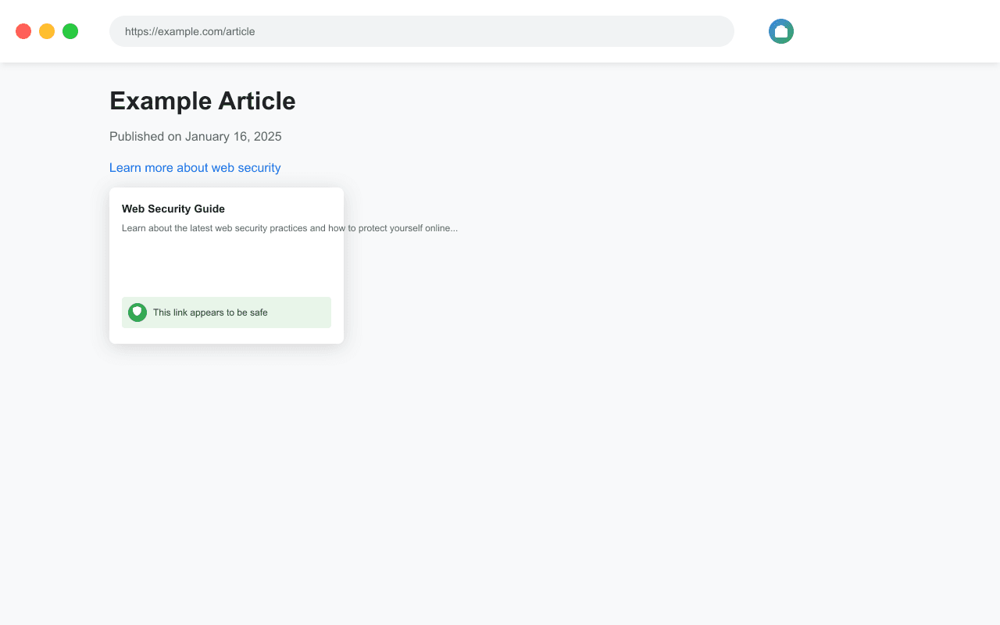

# LinkSense - Smart Link Preview & Security

A Chrome extension that provides instant link previews and security assessments to help you browse more safely and efficiently.



## Features

- 🔍 **Smart Link Previews**: See what's behind a link before clicking
- 🛡️ **Security Assessment**: Know if a link is safe before visiting
- ⚡ **Instant Loading**: Get previews immediately on hover
- 🔒 **Privacy Focused**: No data collection, works locally
- 🎨 **Clean Interface**: Unobtrusive, modern design

## Installation

### From Chrome Web Store
1. Visit the [LinkSense Chrome Web Store page](https://chrome.google.com/webstore/detail/linksense)
2. Click "Add to Chrome"
3. Confirm the installation

### From Source
1. Clone this repository:
   ```bash
   git clone https://github.com/drenjaha/linksense.git
   ```
2. Open Chrome and go to `chrome://extensions`
3. Enable "Developer mode" in the top right
4. Click "Load unpacked" and select the `link-preview-extension` directory

## Development

### Prerequisites
- Node.js (for development tools)
- npm (for dependencies)

### Setup
1. Install dependencies:
   ```bash
   npm install
   ```

2. Generate icons and assets:
   ```bash
   npm run generate-icons
   npm run generate-screenshots
   ```

### Project Structure
```
link-preview-extension/
├── manifest.json           # Extension configuration
├── background.js          # Service worker & security checks
├── content.js            # Preview functionality
├── popup/               # Settings popup
│   ├── index.html
│   └── popup.js
├── preview/            # Preview styles
│   └── styles.css
└── icons/             # Extension icons
```

## Privacy & Security

- No user data collection
- All processing done locally
- No external API calls except for fetching preview data
- [Privacy Policy](PRIVACY.md)

## Contributing

1. Fork the repository
2. Create your feature branch (`git checkout -b feature/AmazingFeature`)
3. Commit your changes (`git commit -m 'Add some AmazingFeature'`)
4. Push to the branch (`git push origin feature/AmazingFeature`)
5. Open a Pull Request

## License

This project is licensed under the MIT License - see the [LICENSE](LICENSE) file for details.

## Contact

Dren Jaha - [drenj@gmail.com]
Project Link: [https://github.com/drenjaha/linksense](https://github.com/drenjaha/linksense)
